# Wildlife Strike

# Table of Contents

1. [Introduction](#1-introduction)

    1.1 [Problem](#11-problem)

2. [Exploratory Data Analysis](#2-exploratory-data-analysis)

    2.1 [Data Overview](#21-data-overview)

    2.2 [Missing Value](#22-missing-value)

    2.3 [Data Quality Finding - Categorical Columns](#23-data-quality-finding---categorical-columns)

3. [Data Pipeline](#3-data-pipeline)

    3.1 [Raw Layer](#31-raw-layer)

    3.2 [Transformation Layer](#32-transformation-layer)

    3.3 [Data Modelling (Star Schema)](#33-data-modelling-star-schema)

    3.4 [Data Loading](#34-data-loading)

    3.5 [Orchestration (Prefect)](#35-orchestration-prefect)

    3.6 [Initial Prototype (Notebook-Based Pipeline)](#36-initial-prototype-notebook-based-pipeline)

    3.7 [dbt](#37-dbt)

    3.8 [BigQuery](#38-bigquery)

4. [Deployment and Serving](#4-deployment-and-serving)

    4.1 [Dashboard](#41-dashboard)

    4.2 [Cloud Run](#42-cloud-run)

5. [Pipeline Execution Flow](#5-pipeline-execution-flow)

6. [Configuration and Setup](#6-configuration-and-setup)

    6.1 [Project Setup (gcloud, Docker, Terraform, and Prefect)](#61-project-setup-gcloud-docker-terraform-and-prefect)

---


## 1. Introduction

Wildlife strike is a serious problem in aviation. It happens when an aircraft hits animals, usually birds, during takeoff, landing, or while flying. This can cause damage to the aircraft, delay flights, and in some cases can be dangerous for passengers and crew.

This project uses the wildlife strike dataset from Kaggle. The dataset contains records from 1990 until 2015, including information about the incident date, aircraft, airport, species, and damage level.

The main goal of this project is to build a data engineering pipeline to process and organize the data so it can be analyzed more easily.

This project focuses building a data pipeline using modern data engineering tools such as Prefect, dbt, BigQuery, and Cloud Run. The goal is to simulate a real-world analytics workflow where raw data is ingested, transformed, and served for decision-making.


### 1.1. Problem

Although many wildlife strike incidents have been recorded, the data is not ready to use directly. The dataset has several issues such as:

* Missing values in many columns
* Inconsistent format in categorical data
* Mixed data types in some fields
* Complex fields with multiple values

Because of these issues, it is difficult to analyze the data and get useful insights.

This project is to build a data pipeline to clean, transform, and structure the data. With a better data structure, we can analyze patterns such as high-risk airports, affected aircraft types, and damage impact.

This system is expected to help airlines and airports make better decisions, reduce risk, and improve safety in the future.


---


## 2. Exploratory Data Analysis

The dataset used in this project comes from Kaggle: [faa/wildlife-strikes](https://www.kaggle.com/datasets/faa/wildlife-strikes).

It contains reported wildlife strike incidents involving military, commercial, and civil aircraft between 1990 and 2015. Each record represents one reported incident and includes information such as incident date, aircraft operator, aircraft make and model, engine information, airport and location, species involved, and aircraft damage.


### 2.1. Data Overview

The dataset contains 174,104 rows and 66 columns.
For easier analysis and documentation, the columns were grouped into 10 categories.

Column Naming Convention:

All column names are standardized in the transformation layer using snake_case format. 
This improves SQL readability, avoids quoting issues.


The column descriptions are as follows:
| No | Original Name        | Clean Name              | Category      | Description                                      |
| -- | -------------------- | ----------------------- | ------------- | ------------------------------------------------ |
| 1  | Record ID            | `record_id`             | incident      | Unique identifier for each incident              |
| 2  | Incident Year        | `incident_year`         | incident      | Year when the incident occurred                  |
| 3  | Incident Month       | `incident_month`        | incident      | Month of the incident (1–12)                     |
| 4  | Incident Day         | `incident_day`          | incident      | Day of the month when incident occurred          |
| 5  | Operator ID          | `operator_id`           | operator      | Code identifying the airline/operator            |
| 6  | Operator             | `operator_name`         | operator      | Name of the airline/operator                     |
| 7  | Aircraft             | `aircraft`              | aircraft      | Aircraft identifier or general type              |
| 8  | Aircraft Type        | `aircraft_type`         | aircraft      | Aircraft category (e.g., commercial, military)   |
| 9  | Aircraft Make        | `aircraft_make`         | aircraft      | Manufacturer of the aircraft                     |
| 10 | Aircraft Model       | `aircraft_model`        | aircraft      | Specific model of the aircraft                   |
| 11 | Aircraft Mass        | `aircraft_mass`         | aircraft      | Weight category of the aircraft                  |
| 12 | Engine Make          | `engine_make`           | engine        | Manufacturer of the engine                       |
| 13 | Engine Model         | `engine_model`          | engine        | Model of the engine                              |
| 14 | Engines              | `engine_count`          | engine        | Number of engines on the aircraft                |
| 15 | Engine Type          | `engine_type`           | engine        | Type of engine (jet, turboprop, etc.)            |
| 16 | Engine1 Position     | `engine1_position`      | engine        | Position of engine 1 on aircraft                 |
| 17 | Engine2 Position     | `engine2_position`      | engine        | Position of engine 2                             |
| 18 | Engine3 Position     | `engine3_position`      | engine        | Position of engine 3                             |
| 19 | Engine4 Position     | `engine4_position`      | engine        | Position of engine 4                             |
| 20 | Airport ID           | `airport_id`            | location      | Unique airport identifier                        |
| 21 | Airport              | `airport_name`          | location      | Name of the airport                              |
| 22 | State                | `state`                 | location      | State where the airport is located               |
| 23 | FAA Region           | `faa_region`            | location      | FAA administrative region                        |
| 24 | Warning Issued       | `warning_issued`        | flight        | Whether bird warning was issued before incident  |
| 25 | Flight Phase         | `flight_phase`          | flight        | Phase of flight (takeoff, landing, cruise, etc.) |
| 26 | Visibility           | `visibility`            | weather       | Weather visibility condition                     |
| 27 | Precipitation        | `precipitation`         | weather       | Weather precipitation condition                  |
| 28 | Height               | `height_ft`             | flight        | Aircraft altitude at time of strike (feet)       |
| 29 | Speed                | `speed_knots`           | flight        | Aircraft speed at time of strike                 |
| 30 | Distance             | `distance_from_airport` | flight        | Distance from airport during incident            |
| 31 | Species ID           | `species_id`            | wildlife      | Identifier for bird species                      |
| 32 | Species Name         | `species_name`          | wildlife      | Name of the bird species                         |
| 33 | Species Quantity     | `species_quantity`      | wildlife      | Number of birds involved                         |
| 34 | Flight Impact        | `flight_impact`         | impact        | Impact severity on flight operations             |
| 35 | Fatalities           | `fatalities`            | impact        | Number of fatalities caused                      |
| 36 | Injuries             | `injuries`              | impact        | Number of injuries caused                        |
| 37 | Aircraft Damage      | `aircraft_damage`       | impact        | Overall damage level to aircraft                 |
| 38 | Radome Strike        | `radome_strike`         | damage_detail | Whether radome (nose dome) was struck            |
| 39 | Radome Damage        | `radome_damage`         | damage_detail | Damage to radome                                 |
| 40 | Windshield Strike    | `windshield_strike`     | damage_detail | Whether windshield was struck                    |
| 41 | Windshield Damage    | `windshield_damage`     | damage_detail | Damage to windshield                             |
| 42 | Nose Strike          | `nose_strike`           | damage_detail | Whether aircraft nose was struck                 |
| 43 | Nose Damage          | `nose_damage`           | damage_detail | Damage to nose                                   |
| 44 | Engine1 Strike       | `engine1_strike`        | damage_detail | Whether engine 1 was struck                      |
| 45 | Engine1 Damage       | `engine1_damage`        | damage_detail | Damage to engine 1                               |
| 46 | Engine2 Strike       | `engine2_strike`        | damage_detail | Whether engine 2 was struck                      |
| 47 | Engine2 Damage       | `engine2_damage`        | damage_detail | Damage to engine 2                               |
| 48 | Engine3 Strike       | `engine3_strike`        | damage_detail | Whether engine 3 was struck                      |
| 49 | Engine3 Damage       | `engine3_damage`        | damage_detail | Damage to engine 3                               |
| 50 | Engine4 Strike       | `engine4_strike`        | damage_detail | Whether engine 4 was struck                      |
| 51 | Engine4 Damage       | `engine4_damage`        | damage_detail | Damage to engine 4                               |
| 52 | Engine Ingested      | `engine_ingested`       | damage_detail | Whether bird was ingested into engine            |
| 53 | Propeller Strike     | `propeller_strike`      | damage_detail | Whether propeller was struck                     |
| 54 | Propeller Damage     | `propeller_damage`      | damage_detail | Damage to propeller                              |
| 55 | Wing or Rotor Strike | `wing_rotor_strike`     | damage_detail | Whether wing or rotor was struck                 |
| 56 | Wing or Rotor Damage | `wing_rotor_damage`     | damage_detail | Damage to wing or rotor                          |
| 57 | Fuselage Strike      | `fuselage_strike`       | damage_detail | Whether fuselage was struck                      |
| 58 | Fuselage Damage      | `fuselage_damage`       | damage_detail | Damage to fuselage                               |
| 59 | Landing Gear Strike  | `landing_gear_strike`   | damage_detail | Whether landing gear was struck                  |
| 60 | Landing Gear Damage  | `landing_gear_damage`   | damage_detail | Damage to landing gear                           |
| 61 | Tail Strike          | `tail_strike`           | damage_detail | Whether tail was struck                          |
| 62 | Tail Damage          | `tail_damage`           | damage_detail | Damage to tail                                   |
| 63 | Lights Strike        | `lights_strike`         | damage_detail | Whether aircraft lights were struck              |
| 64 | Lights Damage        | `lights_damage`         | damage_detail | Damage to lights                                 |
| 65 | Other Strike         | `other_strike`          | damage_detail | Strike occurred on other parts                   |
| 66 | Other Damage         | `other_damage`          | damage_detail | Damage to other parts                            |


The category descriptions are:
| No | Category        | Description                                                                                                |
| -- | --------------- | ---------------------------------------------------------------------------------------------------------- |
| 1  | `incident`      | Core incident metadata including unique ID and date components of when the incident occurred            |
| 2  | `operator`      | Information about the airline or operator responsible for the aircraft                                     |
| 3  | `aircraft`      | General aircraft characteristics such as type, manufacturer, model, and weight class                       |
| 4  | `engine`        | Engine-related details including manufacturer, model, type, number of engines, and their positions         |
| 5  | `location`      | Geographic and airport-related information where the incident occurred                                     |
| 6  | `flight`        | Flight conditions and operational context such as flight phase, altitude, speed, and distance from airport |
| 7  | `weather`       | Environmental conditions at the time of the incident such as visibility and precipitation                  |
| 8  | `wildlife`      | Bird-related information including species identification and quantity involved in the strike              |
| 9  | `impact`        | High-level consequences of the incident including damage severity, injuries, and fatalities                |
| 10 | `damage_detail` | Detailed breakdown of which aircraft parts were struck and the corresponding damage for each part          |


Sample data:

| Record ID | Year | Month | Day | Operator        | Aircraft  | Airport | State | Flight Phase | Species             | Damage | Fatalities | Injuries |
| --------: | ---- | ----- | --- | --------------- | --------- | ------- | ----- | ------------ | ------------------- | ------ | ---------- | -------- |
|    127128 | 1990 | 1     | 1   | Delta Air Lines | B-757-200 | KCVG    | KY    | CLIMB        | Gull                | Yes    | -          | -        |
|    129779 | 1990 | 1     | 1   | Hawaiian Air    | DC-9      | PHLI    | HI    | TAKEOFF RUN  | House Sparrow       | No     | -          | -        |
|    129780 | 1990 | 1     | 2   | Unknown         | Unknown   | PHLI    | HI    | -            | Barn Owl            | No     | -          | -        |
|      2258 | 1990 | 1     | 3   | Military        | A-10A     | KMYR    | SC    | APPROACH     | Unknown Medium Bird | No     | -          | -        |
|      2257 | 1990 | 1     | 3   | Military        | F-16      | KJAX    | FL    | CLIMB        | Finch               | No     | -          | -        |


### 2.2. Missing Value

Several columns contain missing values, especially fields related to injuries, fatalities, engine position, and flight conditions. These null values may mean there was no damage or no injuries reported.

| No | Column           | Null Count  | Null % |
| -- | ---------------- | ----------: | -----: |
| 1  | Injuries         |     173,875 | 99.87% |
| 2  | Fatalities       |     173,539 | 99.68% |
| 3  | Engine4 Position |     171,012 | 98.22% |
| 4  | Engine3 Position |     162,445 | 93.30% |
| 5  | Speed            |     102,846 | 59.07% |
| 6  | Warning Issued   |      97,686 | 56.11% |
| 7  | Precipitation    |      85,782 | 49.27% |
| 8  | Flight Impact    |      74,639 | 42.87% |
| 9  | Distance         |      74,391 | 42.73% |
| 10 | Height           |      70,427 | 40.45% |
| 11 | Visibility       |      64,171 | 36.86% |
| 12 | Engine2 Position |      55,389 | 31.81% |
| 13 | Flight Phase     |      55,302 | 31.76% |
| 14 | Engine Model     |      52,116 | 29.93% |
| 15 | Aircraft Model   |      51,665 | 29.67% |
| 16 | Engine Make      |      50,670 | 29.10% |
| 17 | Engine1 Position |      47,911 | 27.52% |
| 18 | Engine Type      |      46,822 | 26.89% |
| 19 | Aircraft Mass    |      46,784 | 26.87% |
| 20 | Engines          |      46,762 | 26.86% |
| 21 | Aircraft Make    |      43,053 | 24.73% |
| 22 | Aircraft Type    |      41,030 | 23.57% |
| 23 | State            |      21,976 | 12.62% |
| 24 | FAA Region       |      18,902 | 10.86% |
| 25 | Species Quantity |       4,477 |  2.57% |
| 26 | Airport          |         290 |  0.17% |
| 27 | Species Name     |          80 |  0.05% |


Column with no missing value:

| No | Column               |
| -- | -------------------- |
| 1  | Record ID            |
| 2  | Incident Year        |
| 3  | Incident Month       |
| 4  | Incident Day         |
| 5  | Operator ID          |
| 6  | Operator             |
| 7  | Aircraft             |
| 8  | Airport ID           |
| 9  | Species ID           |
| 10 | Aircraft Damage      |
| 11 | Engine1 Damage       |
| 12 | Engine1 Strike       |
| 13 | Engine2 Strike       |
| 14 | Engine2 Damage       |
| 15 | Engine3 Strike       |
| 16 | Engine3 Damage       |
| 17 | Engine4 Strike       |
| 18 | Engine4 Damage       |
| 19 | Engine Ingested      |
| 20 | Propeller Strike     |
| 21 | Propeller Damage     |
| 22 | Wing or Rotor Strike |
| 23 | Wing or Rotor Damage |
| 24 | Fuselage Strike      |
| 25 | Fuselage Damage      |
| 26 | Landing Gear Strike  |
| 27 | Landing Gear Damage  |
| 28 | Tail Strike          |
| 29 | Tail Damage          |
| 30 | Lights Strike        |
| 31 | Lights Damage        |
| 32 | Other Strike         |
| 33 | Other Damage         |
| 34 | Radome Strike        |
| 35 | Radome Damage        |
| 36 | Windshield Strike    |
| 37 | Windshield Damage    |
| 38 | Nose Strike          |
| 39 | Nose Damage          |


### 2.3. Data Quality Finding - Categorical Columns

The main categorical data quality issues are related to mixed data types, inconsistent formatting, and multi-value categorical fields. These findings will guide the transformation stage of the pipeline.

#### 1. Engine Position

| Category          | Details                                                                                                                                                                               |
| ---------------- | ------------------------------------------------------------------------------------------------------------------------------------------------------------------------------------- |
| Columns          | `Engine1 Position`, `Engine2 Position`, `Engine3 Position`, `Engine4 Position`                                                                                                        |
| Issue            | Mixed data types across columns:<br>- Engine1 & Engine3 → string (categorical)<br>- Engine2 & Engine4 → float (numeric)<br><br>All columns represent same meaning but different types |
| Invalid Value    | `Engine3 Position` contains `'CHANGE CODE'` (55 occurrences). In `Engine1 Position`, there is value `C`, so it is possible that `'CHANGE CODE'` should be `C`. |
| Sample Values    | Engine1: `['1','2','3','4','5','6','7','C']`<br>Engine2: `[1.0, 2.0, ..., 7.0]`<br>Engine3: `['1','3','4','5','CHANGE CODE']`<br>Engine4: `[1.0, 3.0, 4.0, 5.0]`                      |
| Planned Handling | - Convert all columns to string (categorical)<br>- Normalize values (e.g., `1.0` → `'1'`)<br>- Replace `'CHANGE CODE'` with `C`.                                                      |


#### 2. Warning Issued

| Category         | Details                                                            |
| ---------------- | ------------------------------------------------------------------ |
| Issue            | Inconsistent casing in categorical values:<br>- `N`, `Y`, `n`, `y` |
| Planned Handling | Standardize values to uppercase:<br>- `n → N`<br>- `y → Y`         |


#### 3. Aircraft Type

| Category         | Details                                                                     |
| ---------------- | --------------------------------------------------------------------------- |
| Issue            | Contains missing values (`NaN`)<br>Valid observed categories: `A`, `B`, `J` |
| Planned Handling | Keep as categorical<br>Preserve missing values as NULL                      |


#### 4. Flight Impact

| Category         | Details                                                                                         |
| ---------------- | ----------------------------------------------------------------------------------------------- |
| Issue            | Duplicate category labels with the same meaning:<br>- `ENGINE SHUT DOWN`<br>- `ENGINE SHUTDOWN` |
| Planned Handling | Standardize to a single category:<br>- `ENGINE SHUT DOWN` → `ENGINE SHUTDOWN`                   |


#### 5. Precipitation

| Category         | Details                                                                                                                        |
| ---------------- | ------------------------------------------------------------------------------------------------------------------------------ |
| Issue            | Multi-value categorical field stored as comma-separated string:<br>- `FOG`<br>- `RAIN`<br>- `FOG, RAIN`<br>- `FOG, RAIN, SNOW` |
| Observation      | Not a data entry error<br>Represents multi-label weather conditions                                                            |
| Planned Handling | Keep as-is in the raw layer                                                                                                    |


#### 6. Visibility

| Category         | Details                                                                      |
| ---------------- | ---------------------------------------------------------------------------- |
| Observation      | Categories appear consistent:<br>- `DAY`, `NIGHT`, `DUSK`, `DAWN`, `UNKNOWN`, `NULL` |
| Planned Handling | Replace NULL value with `UNKOWN`                                                    |


#### 7. Species Quantity

| Category         | Details                                                                                         |
| ---------------- | ----------------------------------------------------------------------------------------------- |
| Observation      | Values are structured as ordinal categories:<br>- `1`<br>- `2-10`<br>- `11-100`<br>- `Over 100` |
| Planned Handling | Keep as categorical<br>No cleaning required                                                     |


#### 8. Engine Make

| Category         | Details                                                                      |
| ---------------- | ---------------------------------------------------------------------------- |
| Observation      | The column contains numeric-like values with NULLs. Although stored as numeric, it represents a categorical code (engine manufacturer identifier), not a measurable value. |
| Planned Handling | Convert the column to string, remove decimal formatting if present (e.g., 123.0 → '123'), and replace NULL or empty values with 'UNKNOWN'.                |


---


## 3. Data Pipeline


### 3.1. Raw Layer

The raw layer stores the dataset in its original structure from the CSV file, with the same column names and closely matching data types. This layer is intended to preserve the source data before any cleaning, standardization, or transformation is applied.

At this stage, a table named raw_wildlife_strike is created to hold the ingested CSV data. An additional column, batch_id, is included to identify which ingestion batch each row belongs to.

The raw table does not enforce primary keys or strict constraints because its purpose is to store data exactly as received from the source. This ensures reliable ingestion, supports reprocessing, and avoids failures caused by duplicate or inconsistent data.

The RAW table is append-only. Each ingestion creates a new batch_id and does not overwrite previous data. This allows historical tracking and safe reprocessing.


### 3.2. Transformation Layer

The staging layer focuses on standardization only (no aggregation, no business logic).

The staging layer is used to clean and standardize raw data before it is modeled into analytical structures such as a star schema. This layer ensures consistent data types, standardized categorical values, and prepares the dataset for downstream processing.

This layer does not enforce strict constraints, as its purpose is to standardize and clean data.

This transformation layer focuses on:
- Minimal business logic.
- Standardization and cleaning only.
- Preparing data for dimensional modeling in the next layer.


Based on the data exploration in EDA section above, the transformations applied are grouped as follows:

1. Column Standardization
   - Convert all column names into snake_case.

2. Data Type Normalization
   - Engine2 and Engine4 position: convert numeric → text and remove decimals.
   - Engine Make: convert numeric → text and remove decimals.

3. Data Cleaning
   - Replace empty string with NULL to ensure consistency.
   - Trim whitespace.
   - All text-based columns are standardized by trimming whitespace and converting empty strings into NULL values to ensure consistency and prevent incorrect grouping in downstream analysis.

4. Categorical Standardization
   - Engine3 Position: 'CHANGE CODE' → 'C'.
   - Warning Issued: convert to uppercase (Y/N).
   - Flight Impact: 'ENGINE SHUT DOWN' → 'ENGINE SHUTDOWN'. Replace NULL → 'UNKNOWN'
   - Visibility: replace NULL → 'UNKNOWN'
   - Engine Make: replace NULL → 'UNKNOWN'
   - State: replace NULL → 'UNKNOWN'
   - FAA Region: replace NULL → 'UNKNOWN'
   - Airport ID: replace NULL → 'UNKNOWN'
   - Airport: replace NULL → 'UNKNOWN'
   - Aircraft Model: replace NULL → 'UNKNOWN'
   - Aircraft Type: replace NULL → 'UNKNOWN'
   - Aircraft Make: replace NULL → 'UNKNOWN'
   - Engine Model: replace NULL → 'UNKNOWN'
   - Engine Type: replace NULL → 'UNKNOWN'
   - Operator ID: replace NULL → 'UNKNOWN'
   - Operator: replace NULL → 'UNKNOWN'
   - Flight Phase: replace NULL → 'UNKNOWN'
   - Precipitation: replace NULL → 'UNKNOWN'
   - Species ID: replace NULL → 'UNKNOWN'
   - Species Name: replace NULL → 'UNKNOWN'
   - Species Quantity: replace NULL → 'UNKNOWN'


A `batch_id` column is added to track each ingestion batch. 
This allows:
- Idempotent processing (safe re-run of failed batches)
- Easier debugging and traceability
- Isolation between multiple ingestion runs

Before inserting, existing records with the same batch_id are deleted to ensure idempotency. This allows the pipeline to safely reprocess a failed batch without creating duplicate records.


All missing values in categorical, name, and identifier columns are standardized into 'UNKNOWN' in the staging layer. This is done to simplify transformation into the star schema, because dimension and fact loading can use already-cleaned values without repeating null-handling logic. This approach also helps ensure complete mapping between fact and dimension tables.


### 3.3. Data Modelling (Star Schema)

For analytical processing, a star schema is implemented to organize the data that is optimized for querying and reporting.

The central table in this model is the fact table, `fact_wildlife_strike`, which stores event-level data. The grain of the fact table is defined as: "one row per wildlife strike incident (record_id)".
This means each record represents a single incident, allowing detailed analysis at the most granular level.

The fact table contains measurable attributes such as:
- operational metrics (e.g., height, speed, distance)
- impact indicators (e.g., strikes and damages on aircraft components)
- incident outcomes (e.g., injuries, fatalities)

Aggregated metrics such as total number of accidents or total damage by location are not stored directly, but are calculated during analysis.

To support analytical queries, several dimension tables are created to describe different aspects of each incident:
* dim_date – date-related attributes
* dim_airport – airport and location information
* dim_operator – airline/operator details
* dim_aircraft – aircraft and engine characteristics
* dim_species – wildlife species information
* dim_visibility – visibility conditions
* dim_precipitation – weather conditions
* dim_flight_phase – phase of flight
* dim_warning – warning status
* dim_flight_impact – impact classification
* dim_species_quantity – number of species involved

Each dimension table uses a surrogate key (BIGSERIAL) as the primary key. Business identifiers from the source data (e.g., airport_id, operator_id) are preserved within the dimensions for traceability.

To ensure consistent joins and avoid missing references, each dimension includes a default 'UNKNOWN' record. This aligns with the staging layer design, where missing categorical values are standardized.

The `fact_wildlife_strike` table contains foreign keys referencing all dimension tables. This structure enables efficient filtering, grouping, and aggregation across multiple dimensions.

A batch_id column is included in the fact table to support:
- traceability of data ingestion
- easier debugging
- selective reprocessing of incorrect data

This allows data to be reloaded safely without affecting other batches.

To improve query performance, indexes are created on all foreign key columns in the fact table. Since analytical queries commonly join the fact table with dimensions using these keys, indexing helps speed up filtering and aggregation.


**ERD Diagram**

The following diagram illustrates the relationships between the fact and dimension tables:

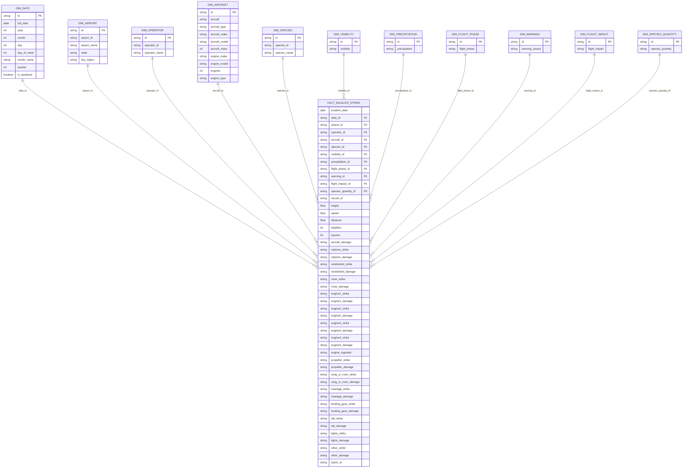


### 3.4. Data Loading

After the data has been cleaned and standardized in the staging table, the next step is loading it into the analytical tables. The analytical layer consists of dimension tables and a fact table.

The loading process is performed in the following order:

* Load data from the staging table into dimension tables.
* Load data from the staging table into the fact table using surrogate keys from the dimensions.

Dimension tables must be loaded first because the fact table depends on them through foreign key relationships. Each dimension table generates its own surrogate key, and these keys are then used when inserting records into the fact table.

To support incremental processing, all loading queries are filtered by batch_id. This ensures that each run only processes data from a specific ingestion batch.


**Dimension Loading**

Each dimension table is populated from `stg_wildlife_strike` by selecting the relevant columns and applying DISTINCT to avoid duplicate source rows. To prevent inserting duplicate dimension records, the query checks whether the corresponding business key already exists in the dimension table.


**Fact Loading**

After all dimension tables have been populated, the fact table can be loaded.

The `fact_wildlife_strike` table stores the measurable attributes of each incident and references all related dimensions through foreign keys. During fact loading, records from `stg_wildlife_strike` are joined to each dimension table in order to retrieve the surrogate keys.

For example:
* dim_date.id becomes fact_wildlife_strike.date_id
* dim_airport.id becomes fact_wildlife_strike.airport_id
* dim_operator.id becomes fact_wildlife_strike.operator_id

This process converts the descriptive values in staging into the dimensional keys required by the star schema.


### 3.5. Orchestration (Prefect)

Prefect is chosen over heavier orchestration tools like Airflow because this project runs locally and prioritizes simplicity, fast iteration, and easier debugging.

The pipeline is orchestrated using Prefect, with the main flow defined in flow/main_flow.py. The flow is intentionally kept simple and executes two core steps sequentially:

1. ingest_task() calls `jobs/ingest.py` to load the latest CSV file into the BigQuery RAW table and returns a batch_id.
2. dbt_task(batch_id) calls `jobs/run_dbt.py`, which executes dbt build with the corresponding batch_id.

This design ensures a deterministic and traceable pipeline:

- Ingestion always completes before transformation begins.
- A single batch_id is consistently propagated across all steps.
- dbt models process only the data associated with the current batch.

If the ingestion step fails, the dbt step is not executed. If dbt fails, the pipeline stops after RAW ingestion, allowing the failed batch to be investigated and reprocessed using its batch_id.

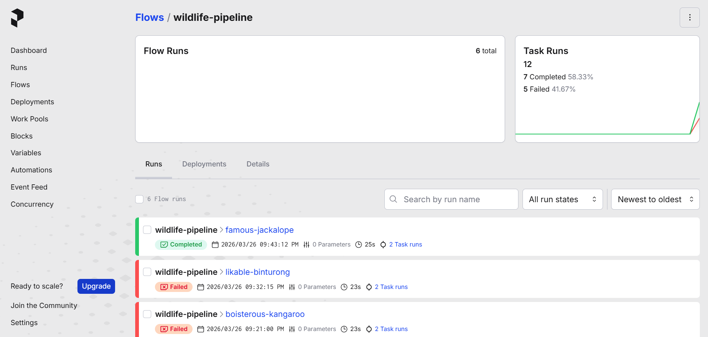


The flow can be run manually or schedule at specific interval.
The flow is deployed locally using Prefect deployments, with a scheduled execution configured to run every 5 minutes.
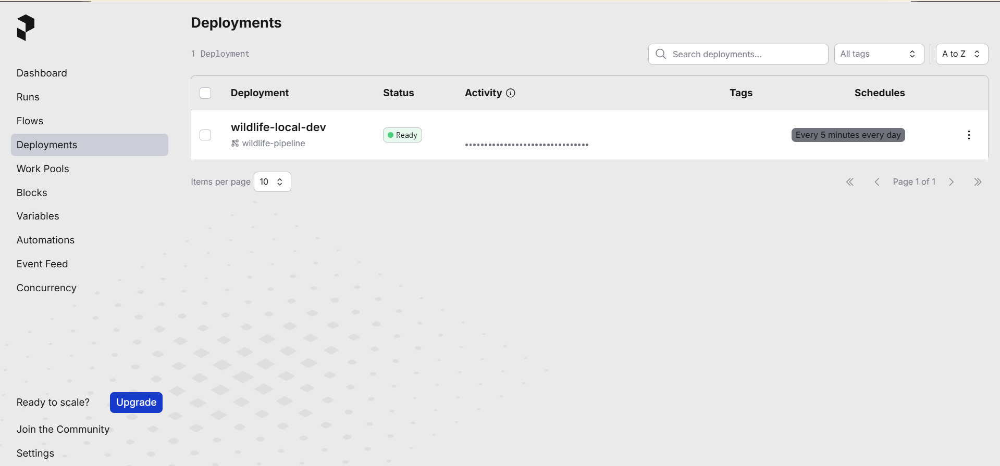


Prefect also provides observability for each pipeline run, including execution status, duration, and task-level details.
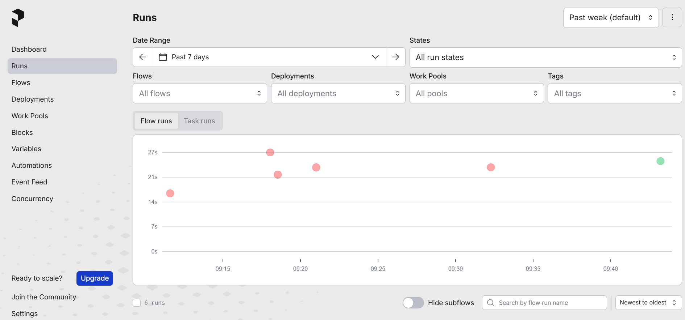
The Prefect dashboard tracks all flow runs, showing successful and failed executions, which helps with monitoring and debugging.

This setup provides a lightweight but production-like orchestration layer, with scheduling, observability, and failure handling managed by Prefect.


### 3.6. Initial Prototype (Notebook-Based Pipeline)

Before the Prefect flow and dbt models were finalized, the pipeline was first developed in Jupyter notebooks under the `notebooks/` folder, using PostgreSQL as the initial storage layer.

The notebooks were used to:

- Explore the RAW dataset and validate assumptions from the EDA phase
- Prototype transformation logic from RAW → STG → MART
- Test data cleaning rules (null handling, normalization, categorical fixes) in an interactive way

Once the logic was stable, the SQL transformations were moved into dbt models, and the execution flow was integrated into the Prefect pipeline.

This approach helped reduce iteration time during development while ensuring that only validated logic was promoted into the production pipeline.


### 3.7. dbt

The transformation and mart layers are built using dbt on top of BigQuery to keep all transformation logic in version-controlled SQL and clearly separate RAW ingestion from analytical modeling. 
dbt reads the RAW table, creates a cleaned staging view, and materializes the dimension and fact tables in the MART dataset. By using dbt with a batch-driven approach, the STG and MART layers can be reproducibly built from the same source batch, ensuring consistent and reliable downstream analytics.

**Dataset flow:**
- RAW → source table (raw_wildlife_strike)
- STG → cleaned view (stg_wildlife_strike)
- MART → dimension and fact tables (dim_*, fact_wildlife_strike)

**Model behavior:**
- The staging model is materialized as a view and applies data cleaning and standardization.
- The mart models are materialized as tables, building the final star schema for analytics.
- Models are connected using dbt ref() to enforce dependency order (RAW → STG → MART).

**How dbt is configured:**
- `.dbt/profiles.yml` defines the BigQuery connection for local runs.
- `dbt_project.yml` sets the project structure and default schemas for `staging` and `marts`.
- `jobs/run_dbt.py` resolves `DBT_PROFILES_DIR` so dbt can run from the repo-local `.dbt` folder, the user home folder, or `/app/.dbt` in Docker.

**How dbt runs in this pipeline:**
- The Prefect flow passes the current `batch_id` into dbt with `dbt build --vars "batch_id: <batch_id>"`.
- The staging model filters RAW by that `batch_id`.
- The dimension and fact models are then built from the filtered staging rows.

**Why dbt is used here:**
- It keeps transformation logic in version-controlled SQL.
- It separates RAW ingestion from analytical modeling.
- It makes the BigQuery STG and MART layers reproducible from the same source batch.

**Data quality with dbt tests**
See it in `stg_wildlife_strike.yml`.
- dbt tests are applied on the staging model to ensure data consistency.
- Key fields such as record_id and batch_id are validated using not_null and unique tests.
- Categorical fields (e.g., warning_issued, flight_phase, visibility) are validated using accepted_values to enforce standardized values.
- These tests act as a validation layer before data is promoted to the MART tables.


### 3.8. BigQuery

BigQuery is the analytical data warehouse used in this project to store and serve data across RAW, STG, and MART layers.

It is chosen due to:

* Serverless architecture (no infrastructure management).
* Seamless integration with dbt.
* High performance for analytical workloads.
* Support for partitioning and clustering.

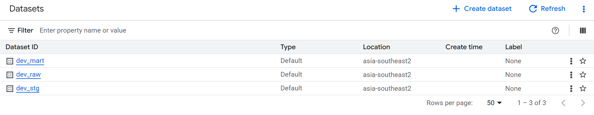

**Dataset layout:**
- `BQ_RAW_DATASET` stores the landing table `raw_wildlife_strike`
- `BQ_STG_DATASET` stores the cleaned staging model `stg_wildlife_strike`
- `BQ_MART_DATASET` stores the dimension tables and `fact_wildlife_strike`


**Naming convention:**
* RAW: raw_*
* STG: stg_*
* MART: dim_*, fact_*


**Data Flow:**
* CSV ingestion via Prefect → loaded into dev_raw.
* dbt transforms RAW → STG (cleaning & standardization).
* dbt builds MART (star schema).
* Dashboard queries MART layer.

**Layer usage:**
- RAW receives the CSV data and lineage metadata from the local ingestion job.
  - Stores raw ingested data (append-only)
  - Preserves original structure
  - Includes ingestion metadata (batch_id, timestamp)
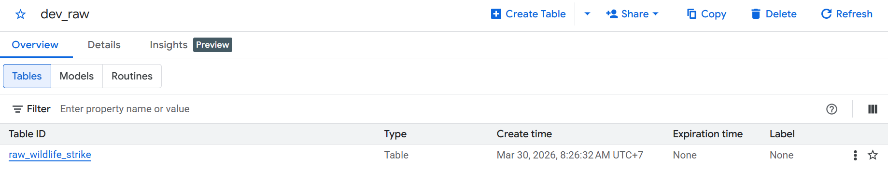

- STG standardizes and filters records for a single `batch_id`.
  - Applies data cleaning and normalization.
  - Filters data by batch_id.
  - Implemented as a VIEW to avoid duplication and ensure freshness.
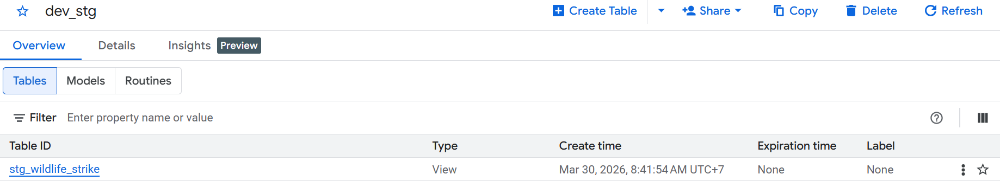

- MART stores the star schema used by downstream analysis and dashboards.
  - Implements star schema:
    - Fact: fact_wildlife_strike.
    - Dimensions: aircraft, airport, operator, etc.
  - Optimized for analytical queries using partition and clustering.
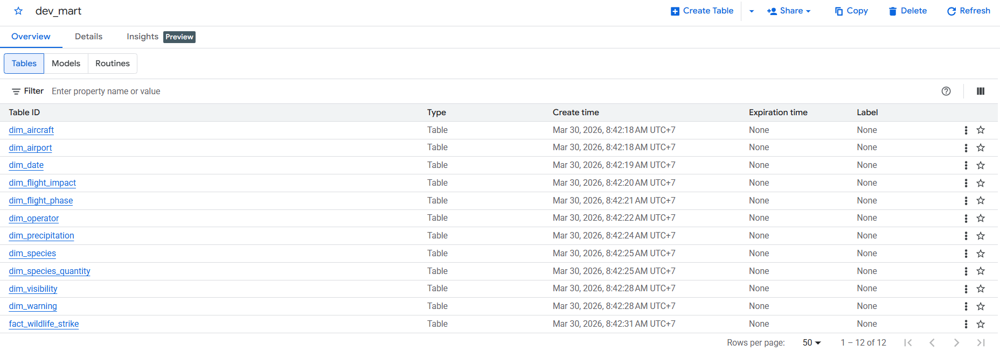


The fact table can be partitioned by incident_date and clustered by frequently filtered fields such as airport_id or species_id to improve query performance.


Local access:
- The project uses BigQuery with application default credentials for local development.
- The recommended setup is `gcloud auth application-default login`.
- `GCP_PROJECT_ID` and `GCP_REGION` must be set so ingestion and dbt jobs connect to the correct project and location.


---


## 4. Deployment and Serving

### 4.1. Dashboard

The dashboard is a Streamlit app in `dashboard/dashboard.py` that reads the MART tables from BigQuery and presents the pipeline output as interactive analytics.


What the dashboard does:
- Queries `BQ_MART_DATASET` using `GCP_PROJECT_ID` or `GOOGLE_CLOUD_PROJECT`
- Uses `fact_wildlife_strike` plus the dimension tables for date, airport, species, and flight phase
- Shows KPI cards for total incidents, aircraft damage, and injuries
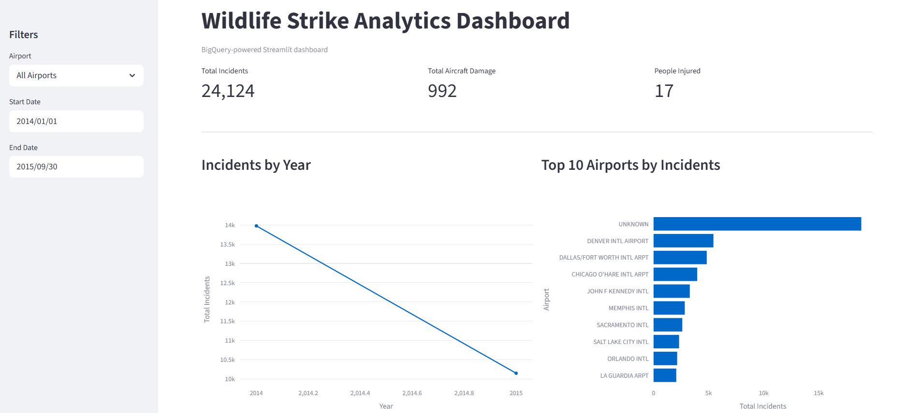
- Displays trends, top airports, top species, flight phase distribution, and a detailed incident table
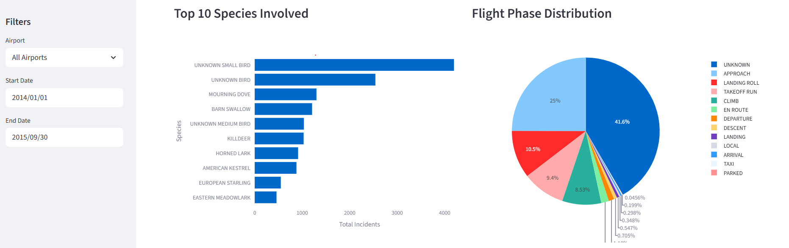
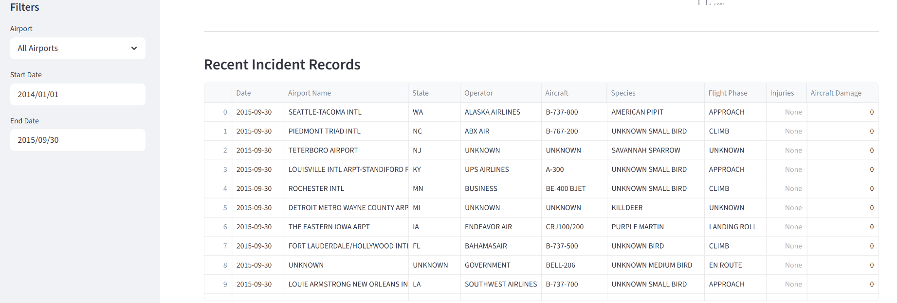
- Adds sidebar filters for airport and date range

How it runs:
- The app is containerized with `Dockerfile.dashboard`
- Runs as a web service on port 8080
- The image installs the packages in `requirements.dashboard.txt`, including `streamlit`, `plotly`, `google-cloud-bigquery`, and `db-dtypes`

BigQuery Integration:
- Uses Application Default Credentials locally and the Cloud Run service account in production
- Reads only from the MART dataset
- Caches the BigQuery client and query results to reduce repeated scans

The dashboard is packaged with `Dockerfile.dashboard` so it can run consistently in Cloud Run.
The container:
- Starts from `python:3.12-slim`
- Installs the dependencies from `requirements.dashboard.txt`
- Copies the `dashboard/` directory into `/app`
- Exposes port `8080`
- Runs `streamlit run dashboard/dashboard.py --server.port=8080 --server.address=0.0.0.0`

Deployment to GCP:
- The image uses `GCP_REGION` and `BQ_MART_DATASET` as runtime environment variables.
- `db-dtypes` is included so Streamlit can convert BigQuery results to pandas dataframes.
- Rebuild the image whenever dashboard code or dashboard dependencies change.


Cloud Run

Cloud Run is used as the public serving layer for the dashboard application. The dashboard container is built locally, pushed to Artifact Registry, and then deployed as a Cloud Run service.

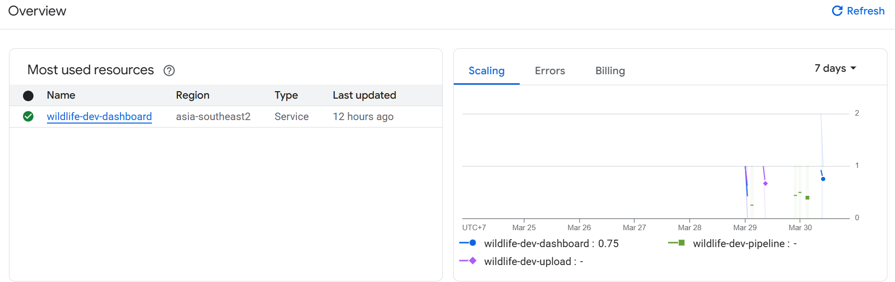

How it is used:
- The dashboard Docker image is stored in Artifact Registry.
- Terraform provisions and manages the Cloud Run service, the related IAM configuration, and the image reference used for deployment.
- When users open the dashboard, the application queries the MART tables in BigQuery in real time.
- The service is stateless, so Cloud Run only handles request serving and does not keep application data locally.


Operational notes:
- Use immutable image tags when deploying dashboard changes to avoid stale revisions.
- `gcloud auth configure-docker` is required before pushing to Artifact Registry.
- The Cloud Run service account needs BigQuery read access to the MART dataset.


## 5. Pipeline Execution Flow

The end-to-end pipeline runs as follows:

1. User places CSV file in DATA_DIR
2. Prefect flow starts
3. ingest_task:
   - Reads CSV
   - Loads into BigQuery RAW
   - Generates batch_id
4. dbt_task:
   - Runs dbt build with batch_id
   - Builds STG view
   - Loads dimensions
   - Loads fact table
5. Dashboard:
   - Queries MART tables in BigQuery
   - Displays analytics in Streamlit


## 6. Configuration and Setup

Configure the files below depending on what you are running:

1. `config.py`
- Local runtime defaults for `DATA_DIR`, `GCP_PROJECT_ID`, `GCP_REGION`, and BigQuery dataset/table names.

2. `.dbt/profiles.yml`
- dbt connection profile used when running dbt locally.

3. `terraform/terraform.tfvars`
- Terraform deployment inputs for project ID, region, and dashboard image.
- Create this file from `terraform/terraform.tfvars.example`.

Environment variables can override most defaults in `config.py` and `.dbt/profiles.yml`.


## 6.1. Project Setup (gcloud, Docker, Terraform, and Prefect)

This project uses a hybrid setup:
- Local machine
  - Runs the Prefect orchestration
  - Executes ingestion and dbt transformations
- GCP
  - BigQuery as the analytical warehouse
  - Cloud Run for serving the dashboard

The setup combines:

- gcloud → authentication to access BigQuery
- Prefect → orchestration of ingestion and transformation
- Docker → packaging the dashboard
- Terraform → provisioning GCP infrastructure


### 1. gcloud authentication and local environment
The local pipeline uses Application Default Credentials to access BigQuery.
```
gcloud auth application-default login
```

Set environment variables:
```
export GCP_PROJECT_ID="<your-project-id>"
export GCP_REGION="your-gcp-region"
export DATA_DIR="/absolute/path/to/csv"
export BQ_RAW_DATASET="dev_raw"
export BQ_STG_DATASET="dev_stg"
export BQ_MART_DATASET="dev_mart"
```

### 2. Prefect setup and orchestration

Prefect is used to orchestrate the pipeline locally. It controls the execution order:

- Ingestion → load CSV into BigQuery RAW
- Transformation → run dbt for STG and MART

Install Prefect (already included in requirements.pipeline.txt):
```
pip install -r requirements.pipeline.txt
```

Start Prefect server for moitoring:
```
prefect server start
```

Run the pipeline:
```
python flow/main_flow.py
```

Or run with scheduling:
```
if __name__ == "__main__":
    wildlife_pipeline.serve(
        name="local-dev",
        cron="0/5 * * * *"
    )
```


### 3. Docker for the dashboard

Docker is used only for the dashboard layer.

Build the image:
```
docker build -t your-region-docker.pkg.dev/<project-id>/wildlife/wildlife-dashboard:latest -f Dockerfile.dashboard .
```

Authenticate Docker to GCP:
```
gcloud auth configure-docker
```

Push the image:
```
docker push your-region-docker.pkg.dev/<project-id>/wildlife/wildlife-dashboard:latest
```

### 4. Terraform for GCP infrastructure

Terraform provisions:

BigQuery datasets (raw, stg, mart)
Artifact Registry repository
Cloud Run dashboard service

Setup:
```
cd terraform
cp terraform.tfvars.example terraform.tfvars
```

Update variables:
```
project_id
region
dashboard_image
```

Run:
```
terraform init
terraform apply
```


### Note
The live demo is off because my GCP trial has expired.


